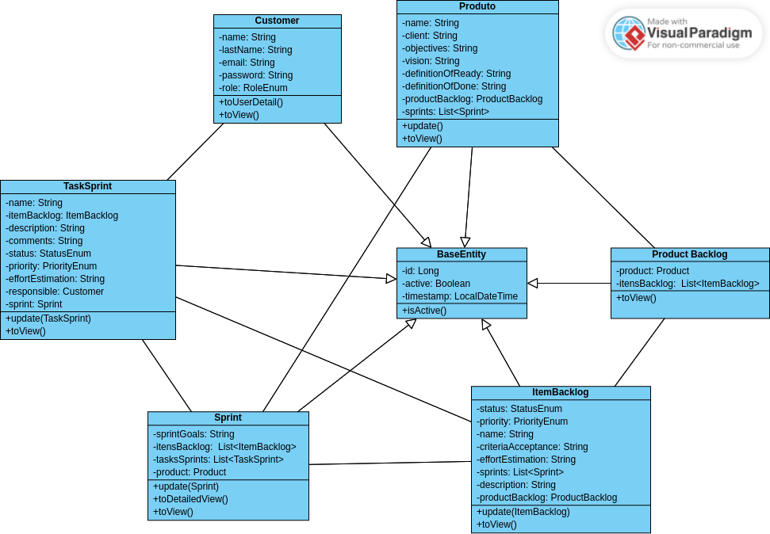
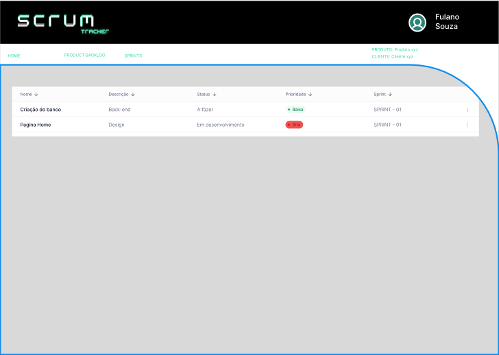
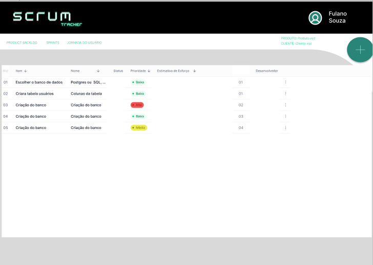

# Scrum Tracker

Scrum Tracker é uma aplicação desenvolvida em Typescript e React.js (Vite) para o frontend, e Spring com Java para o backend. O sistema permite aos usuários realizar diversas operações relacionadas ao gerenciamento de projetos utilizando a metodologia Scrum.

## Funcionalidades Principais

- **Cadastro de Produto:** Os usuários podem cadastrar novos produtos no sistema.
  
- **Associação de Product Backlog:** Associar um Product Backlog a um produto específico.

- **Adição de Itens ao Product Backlog:** Adicionar itens ao Product Backlog, especificando detalhes como descrição, prioridade, estado, estimativa de esforço e critérios de aceitação.

- **Definição de Sprints:** Associar itens do Product Backlog a uma Sprint, facilitando o planejamento e a execução do projeto.

- **Adição de Tarefas:** Adicionar tarefas específicas a cada Sprint especificando detalhes como descrição, estado, prioridade e usuário responsável.

## Perfis de Usuários

- **Admin:** Tem permissão para executar todas as operações, incluindo tarefas administrativas.

- **Product Owner e Scrum Master:** Podem criar, editar e desabilitar qualquer item relacionado ao Scrum.

- **Desenvolvedor:** Pode editar tarefas associadas à Sprint e visualizar qualquer item relaciona ao Scrum.

## Autenticação

O sistema utiliza autenticação baseada em JWT (JSON Web Tokens) para garantir a segurança das operações.

## Histórias do Usuário


## Diagrama de Classes




## Design das Páginas





## Autores

- [Angelina Melo](https://github.com/ajuliamm)
- [Caique Prado](https://github.com/CaiquePrado)
- [Chaiene Caroline](https://github.com/ChaiCaroline)
- [Victor Silva](https://github.com/victorhfsilva)

## Start DB

Este projeto foi um desafio proposto pela empresa DB durante a incubação do estágio Start DB 2023/2. Agradecemos a oportunidade de aprendizado e crescimento proporcionada por este desafio.

## Como Executar o Projeto

1. **Clonar o Repositório:**
   ```bash
   git clone https://github.com/START-DB-2023/ScrumTracker
   ```

2. **Configurar o Frontend:**
   ```bash
   cd scrum-tracker-front-end/scrum-tracker-ui
   npm install
   npm run dev
   ```

3. **Configurar o Backend:**
   ```bash
   cd /scrum-tracker-back-end/scrum-tracker-api
   ./gradlew spring-boot:run
   ```

4. **Acessar o Sistema:**
   - Frontend: [http://localhost:5173](http://localhost:5173)
   - Backend: [http://localhost:8080](http://localhost:8080)

**Nota:** Certifique-se de ter o Node.js e o Java instalados em seu ambiente de desenvolvimento.